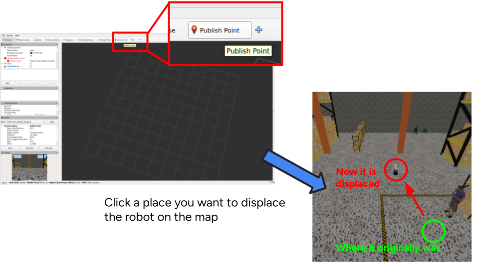

# KTH DD2410 (IROB) Assignment 5

## 1. 🖥️ Usage for Lab PC

We recommend you to run this project in the Lab PC since it is more well-tested. Nevertheless, it is also fine to run on your on device, for that, see Section 2.

### 1.1 Pre-requisites

Clone the repository:
```bash
git clone https://github.com/Ikemura-kei/IROB_Mobile_Robot_Project.git
```

Make sure you have enough disk quota left on the lab machine. A fully-used quota can even create login issues.

We provide a simple utility to check both the disk quota used and the storage distribution. Just run

```bash
bash scripts/check_disk_usage.sh 
```

A window should pop-up with the information on disk quota usage percentage and storage distribution. It will refresh periodically so you can see your real-time disk usage. An interesting observation would be open `Chrome` and you might see disk usage slowly rises, since `Chrome` puts cache and stuff. Cleaning the cache directory is recommended once in a while.

### 1.2 Installation

```bash
cd IROB_Mobile_Robot_Project

source /etc/profile.d/modules.sh # This line by now should be in your .bashrc, if not, either add it now or accept the fact that you need to run this everytime.
module add dd2410 # This line by now should be in your .bashrc, if not, either add it now or accept the fact that you need to run this everytime.

pixi shell
```

Then build:

```bash
MAKEFLAGS=-j2 CMAKE_BUILD_PARALLEL_LEVEL=2 colcon build --base-paths src/Warehouse_robot --parallel-workers 4
```

> ⚠️ **Keep those two variables.** They cap how many compilers run at once.
> `colcon` builds four packages in parallel and each package's `make` then uses
> every core by itself, so without the cap you get four times as many concurrent
> compilers as the machine has cores, which is enough to exhaust its RAM and
> freeze it.

> Note: the build process can take up to 10 minutes, so when it is the first time you build this, some patience are needed.

If you are aiming for grade A and plan to build your mission as a behaviour
tree, install `py_trees` now — the lab module does not ship it, and its Python
has no `pip`, so it goes into your own home directory:

```bash
pip install --user --break-system-packages py_trees
```

### 1.3 Running the project codebase

Open two terminals:

Terminal-1:
```bash
source /etc/profile.d/modules.sh
module add dd2410
pixi shell
source install/setup.bash
source scripts/env_vars.sh # A convinient script to set all variables, you can put it into .bashrc if you like
GRADE=e ros2 launch warehouse_inventory_robot mission.launch.py

# You can also run Gazebo in headless mode to be a bit faster on execution
GRADE=e HEADLESS=true ros2 launch warehouse_inventory_robot mission.launch.py
```

Terminal-2:
```bash
source /etc/profile.d/modules.sh
module add dd2410
pixi shell
source install/setup.bash
source scripts/env_vars.sh # A convinient script to set all variables, you can put it into .bashrc if you like
GRADE=e ros2 run warehouse_inventory_robot mission_node --ros-args -p use_sim_time:=true
```

> ⚠️ **Do not `export ROS_LOCALHOST_ONLY=1`.** It breaks node discovery on a graph
> this size, so `/scan` never reaches ROS —
> `scripts/env_vars.sh` already keeps your ROS traffic on this machine.

Use the same grade in both — `GRADE` is what selects it, exactly as in
section 2. Change it to `c` or `a` for those grades. If you would rather not
repeat it, `export GRADE=c` once per terminal does the same thing.

In case changes are made to `mission_node.py`, rebuild only that package:
```bash
colcon build --base-paths src/Warehouse_robot --packages-select warehouse_inventory_robot
```

`demo_grade_e.mp4` in the repository root shows what a finished grade-e run looks like.

Leave the pixi shell environment with the command `exit`.

#### Grade A: relocating the robot

For grade `a` the robot is not told where it starts — it has to work that out
for itself, which is what AMCL is for. `mission.launch.py` starts the helper for
this automatically, so nothing extra needs launching: pick RViz's **Publish
Point** tool and click anywhere on the map: the robot and its dock move there
together. The click is refused if the spot is not clear.

Do this once the simulation is up but **before** starting `mission_node` —
relocating mid-run teleports the robot out from under the running mission.

The examining TA will do exactly this during the examination, choosing the spot
themselves, so make sure your localization recovers from a starting pose you did
not pick.



## 2. 💻 Usage on your own devices

### 2.1 Installation

Please clone the repo:
```bash
git clone https://github.com/Ikemura-kei/IROB_Mobile_Robot_Project.git
```

Then please run the following to install:
```bash
cd IROB_Mobile_Robot_Project
pixi shell --manifest-path pixi
pixi run build
```

The first command downloads the whole ROS 2 stack and drops you in a shell that
has it; the second builds the workspace. Expect the install to take a while and
a few GB the first time. It is cached, so later runs are fast.

### 2.2 Running the project codebase

Open two terminals. **Each needs its own `pixi shell`** — the environment does
not carry between terminals.

Terminal-1:
```bash
pixi shell --manifest-path pixi
source scripts/env_vars.sh # A convinient script to set all variables, you can put it into .bashrc if you like
GRADE=e pixi run mission

# You can also run Gazebo in headless mode to be a bit faster on execution
HEADLESS=true GRADE=e pixi run mission
```

Terminal-2:
```bash
pixi shell --manifest-path pixi
source scripts/env_vars.sh # A convinient script to set all variables, you can put it into .bashrc if you like
GRADE=e pixi run mission-node
```

In case changes are made to `mission_node.py`, you only need to recompile that specific package. Feel free to use the provided utility `pixi run build-mission`, which builds only the package you modified.

#### Grade A: relocating the robot

For grade `a` the robot is not told where it starts — it has to work that out
for itself, which is what AMCL is for. `mission.launch.py` starts the helper for
this automatically, so nothing extra needs launching: pick RViz's **Publish
Point** tool and click anywhere on the map: the robot and its dock move there
together. The click is refused if the spot is not clear.

Do this once the simulation is up but **before** starting `mission_node` —
relocating mid-run teleports the robot out from under the running mission.

The examining TA will do exactly this during the examination, choosing the spot
themselves, so make sure your localization recovers from a starting pose you did
not pick.


## 3. 💡 Hints and tips
> You will need to have configuration files for at least `nav2` and `amcl` packages. Those configuration files can be placed at `src/Warehouse_robot/warehouse_inventory_robot/config`!

> We provide the map of the environment at `src/Warehouse_robot/warehouse_inventory_robot/maps`, so you do not need to generate one yourself.

> If a launch comes up looking wrong, stop it with `Ctrl-C` and run `bash scripts/cleanup.sh` before trying again — Gazebo does not always exit cleanly.

> Building your mission as a behaviour tree? The lab module ships no `py_trees` and its Python has no `pip`, so install it into your own home directory with `pip install --user --break-system-packages py_trees`.

> ⚠️ Feel free to add your own files (configuration files, utilities, and so on), but unless you have a very good justification, these are the only two files you should edit:
> * `src/Warehouse_robot/warehouse_inventory_robot/launch/mission.launch.py`
> * `src/Warehouse_robot/warehouse_inventory_robot/warehouse_inventory_robot/mission_node.py`
